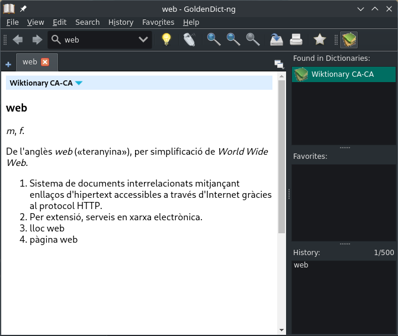
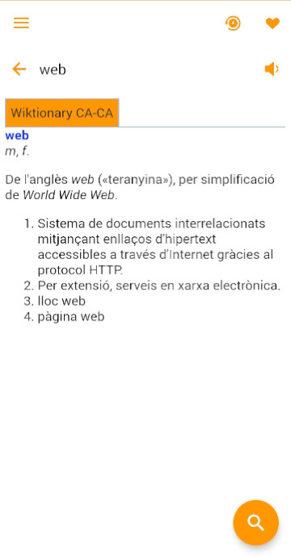

Ja fa temps que cercava un diccionari català que pogués descarregar i fer servir sense connexió. Estic una mica fart d'haver de fer-ho tot per internet, sovint deixant una gran empremta ecològica sense cap necessitat, ja que són serveis que es podrien executar en local si es vol. I per casualitat, cercant un diccionari per al meu llibre electrònic (sobre el qual molt aviat us duré una nova entrada al bloc) l'he trobat: un diccionari que fa servir les dades del Viccionari i les converteix a un format obert i fàcil de gestionar.

Aquest projecte sobre el qual us estic parlant és [eBook Reader Dictionaries](https://github.com/BoboTiG/ebook-reader-dict/), que fent servir la base de dades del [Viccionari](https://ca.wiktionary.org/) crea un diccionari molt complet i actualitzat. [Aquí](https://github.com/BoboTiG/ebook-reader-dict/blob/master/docs/ca/README.md) teniu tota la informació en català (traduïda per un servidor), des d'aquest mateix enllaç podeu trobar els enllaços de descàrrega a tots els formats i versions. Tot el que explicaré a continuació serà utilitzant la versió completa en format _StarDict_.

# A l'ordinador (versió gràfica)
Per accedir a aquest fantàstic diccionari des de l'ordinador gràficament faig servir l'aplicació `GoldenDict-ng`. ([Repositori](https://github.com/xiaoyifang/goldendict-ng) a Github). Disponible, com m'agrada que sigui, per Linux, MacOS i Windows. Distribuït sota una llicència _GPL-v3_. L'ús és molt simple i intuïtiu. I no només podeu afegir-hi aquest diccionari, podeu afegir-hi tots els diccionaris que vulgueu en format _StarDict_.

Afegir-ne un és molt fàcil, només cal que ens dirigim a _Edit > Dictionaries_ o premem _F3_. A la barra de la dreta i veurem el botó _Add_, en prémer-lo se'ns obrirà un navegador de fitxers, ens dirigirem a la carpeta on hem descomprimit el diccionari i premerem el botó _D'acord_. També podeu desactivar els diccionaris anglesos que venen instal·lats per defecte des de les pestanyes de _Wikipedia_ i _DICT servers_. Per acabar, premerem el botó _OK_ situat a la part inferior per aplicar tots els canvis i sortir de la configuració dels diccionaris.

També podeu configurar-hi moltes altres coses, utilitats de tota mena com dreceres de teclat o sistemes per veure'n la pronunciació. Si voleu un article complet sobre com tinc configurat el `GoldenDict-ng`, feu-m'ho arribar des de qualsevol de les meves xarxes socials o obrint un _Issue_ al repositori de GitHub del bloc. Mentrestant, però, us recomano que doneu una ullada a la [documentació oficial](https://xiaoyifang.github.io/goldendict-ng/).

# Al mòbil
També m'agrada tenir un diccionari sempre a mà. I sovint és útil quan no tinc connexió o no puc treure el mode avió. L'aplicació que he trobat és `QDict`. Aquesta aplicació ens permet gestionar els diccionaris d'una manera ben simple i fàcil des del mòbil. També compta amb moltes funcions com una llista de paraules preferides. Té una llicència _Apache-2.0_. La podeu trobar a F-Droid des d'[aquest](https://f-droid.org/packages/com.annie.dictionary.fork/) enllaç i a Google Play des d'[aquest](https://play.google.com/store/apps/details?id=com.annie.dictionary).

Afegir un diccionari és ben fàcil, només cal que baixem el diccionari i que el descomprimim a l'emmagatzematge intern, dins la carpeta _QDict/dicts/_. Llavors ens dirigim al menú lateral prement el botó dels tres guions, premem _Select dictionary_ i activem en diccionari fent clic sobre seu. Ara sortim del menú lateral prement qualsevol part de la pantalla que no sigui el menú i llestos. Amb el botó de cercar a la cantonada inferior dreta podeu cercar al diccionari.

També us animo, que si trobeu alguna paraula que no hi sigui o alguna errada a una definició, podeu editar-la des del lloc web del [Viccionari](https://ca.wiktionary.org/). Que funciona de forma col·laborativa, com la Viquipèdia, ja que tambés està sota el braç de la _Fundació Wikimedia_.